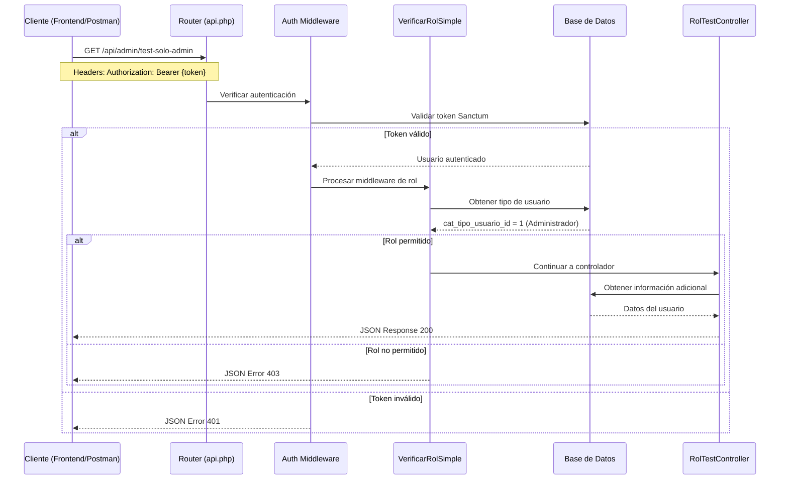

# Módulo de Roles - Sistema de Participación Ciudadana

## Índice
1. [Introducción](#introducción)
2. [Arquitectura del Sistema](#arquitectura-del-sistema)
3. [Componentes del Sistema](#componentes-del-sistema)
4. [Flujo de Petición HTTP](#flujo-de-petición-http)
5. [APIs Disponibles](#apis-disponibles)
6. [Testing y Validación](#testing-y-validación)
7. [Principios de Clean Code](#principios-de-clean-code)
8. [Mejoras Propuestas](#mejoras-propuestas)

---

## Introducción

El **Módulo de Roles** implementa un sistema de autorización basado en roles para controlar el acceso a diferentes funcionalidades de la aplicación. El sistema maneja 4 tipos de usuarios: **Administrador**, **Supervisor**, **Ciudadano** y **Colectivo**, cada uno con permisos específicos.

### Objetivos del Sistema
- ✅ **Seguridad**: Proteger endpoints según el rol del usuario
- ✅ **Simplicidad**: Implementación clara y mantenible
- ✅ **Escalabilidad**: Fácil agregar nuevos roles o permisos
- ✅ **Testabilidad**: Sistema completamente verificable

---

## Arquitectura del Sistema

### Diagrama de Componentes
```
┌─────────────────┐    ┌──────────────────┐    ┌─────────────────┐
│   Frontend      │ -> │   API Routes     │ -> │   Middleware    │
│   (POSTMAN)     │    │   (api.php)      │    │ VerificarRol    │
└─────────────────┘    └──────────────────┘    └─────────────────┘
                                                         |
┌─────────────────┐    ┌──────────────────┐             v
│   Controller    │ <- │   Enum          │    ┌─────────────────┐
│ RolTestController│    │   RolUsuario    │    │   Database      │
└─────────────────┘    └──────────────────┘    │   Validation    │
                                                └─────────────────┘
```

### Patrones Implementados
- **Middleware Pattern**: Para verificación de roles
- **Enum Pattern**: Para definición de roles tipados
- **Repository Pattern**: Acceso a datos estructurado
- **Command Pattern**: Testing automatizado

---

## Componentes del Sistema

### 1. RolUsuario.php (Enum)

**📍 Ubicación**: `app/Enums/RolUsuario.php`

**🎯 Propósito**: Define los tipos de usuario del sistema usando PHP 8+ Enums

**📥 Recibe**: N/A (definición estática)

**📤 Devuelve**: 
- `etiqueta()`: Nombre del rol en español
- `descripcion()`: Descripción detallada del rol
- `nivelJerarquico()`: Nivel numérico para comparaciones

**✅ Validaciones**:
- Garantiza que solo existan los 4 roles definidos
- Previene errores de tipeo en nombres de roles
- Proporciona información estructurada de cada rol

**📋 Ejemplo de uso**:
```php
$rol = RolUsuario::ADMINISTRADOR;
echo $rol->etiqueta(); // "Administrador"
echo $rol->descripcion(); // "Usuario con acceso completo al sistema"
echo $rol->nivelJerarquico(); // 4
```

### 2. VerificarRolSimple.php (Middleware)

**📍 Ubicación**: `app/Http/Middleware/VerificarRolSimple.php`

**🎯 Propósito**: Intercepta peticiones HTTP y verifica si el usuario tiene los roles necesarios

**📥 Recibe**: 
- `Request $request`: Petición HTTP entrante
- `...$rolesPermitidos`: Lista de roles que pueden acceder

**📤 Devuelve**: 
- `Response 200`: Si el usuario tiene permisos (continúa al controlador)
- `Response 401`: Si no está autenticado
- `Response 403`: Si no tiene el rol necesario

**✅ Validaciones**:
1. **Autenticación**: Verifica que el usuario esté logueado
2. **Existencia de rol**: Confirma que el usuario tenga un rol asignado
3. **Autorización**: Valida que el rol esté en la lista de permitidos

**📋 Flujo interno**:
```php
// 1. Verificar autenticación
if (!Auth::check()) return 401;

// 2. Obtener rol del usuario
$tipoUsuario = CatTipoDeUsuario::find($usuario->cat_tipo_usuario_id);

// 3. Verificar rol permitido
if (!in_array($rolActual, $rolesPermitidos)) return 403;

// 4. Continuar al controlador
return $next($request);
```

### 3. RolTestController.php (Controlador)

**📍 Ubicación**: `app/Http/Controllers/Api/RolTestController.php`

**🎯 Propósito**: Proporciona endpoints de prueba para validar el funcionamiento del sistema de roles

**📥 Recibe**: 
- `Request $request`: Petición HTTP con token de autenticación

**📤 Devuelve**: 
- JSON con información del usuario y confirmación de acceso
- Estructura estándar: `{mensaje, usuario, rol, timestamp}`

**✅ Validaciones**:
- El middleware ya validó autenticación y roles
- Solo confirma acceso exitoso y retorna información

**📋 Métodos disponibles**:
```php
// Solo Administrador
public function soloAdministrador(Request $request)

// Administrador + Supervisor  
public function adminYSupervisor(Request $request)

// Ciudadano + Colectivo
public function ciudadanoYColectivo(Request $request)

// Información del usuario actual
public function miInfo(Request $request)
```

### 4. ProbarRoles.php (Comando Artisan)

**📍 Ubicación**: `app/Console/Commands/ProbarRoles.php`

**🎯 Propósito**: Automatizar testing del sistema de roles mediante peticiones HTTP simuladas

**📥 Recibe**: 
- `{usuario_email?}`: Email del usuario a probar (opcional)
- `{--todos}`: Flag para probar todos los usuarios

**📤 Devuelve**: 
- Reporte en consola con resultados de cada test
- Códigos de colores (✅ éxito, ❌ error, ⚠️ advertencia)

**✅ Validaciones**:
- Verifica que los usuarios existan en base de datos
- Genera tokens temporales para testing
- Limpia tokens después de cada prueba
- Valida respuestas HTTP esperadas vs obtenidas

**📋 Funcionalidades**:
```bash
# Menú interactivo
php artisan test:roles

# Usuario específico
php artisan test:roles usuario@email.com

# Todos los usuarios
php artisan test:roles --todos
```

### 5. api.php (Rutas)

**📍 Ubicación**: `routes/api.php`

**🎯 Propósito**: Define las rutas protegidas y sus respectivos middlewares de rol

**📥 Recibe**: 
- Peticiones HTTP con tokens Bearer
- Headers de autenticación

**📤 Devuelve**: 
- Acceso a controladores correspondientes
- Respuestas de error si no cumple requisitos

**✅ Validaciones**:
- Aplica middleware `auth:sanctum` para autenticación
- Aplica middleware `rol:` con roles específicos
- Estructura jerárquica de permisos

**📋 Estructura de rutas**:
```php
// Todos los usuarios autenticados
Route::middleware(['auth:sanctum'])->group(function () {
    Route::get('mi-info', [RolTestController::class, 'miInfo']);
    
    // Solo Admin + Supervisor
    Route::middleware(['rol:Administrador,Supervisor'])->group(function () {
        Route::prefix('gestion')->group(function () {
            Route::get('test-admin-supervisor', [RolTestController::class, 'adminYSupervisor']);
        });
    });
    
    // Solo Administrador
    Route::middleware(['rol:Administrador'])->group(function () {
        Route::prefix('admin')->group(function () {
            Route::get('test-solo-admin', [RolTestController::class, 'soloAdministrador']);
        });
    });
    
    // Solo Ciudadano + Colectivo
    Route::middleware(['rol:Ciudadano,Colectivo'])->group(function () {
        Route::prefix('ciudadano')->group(function () {
            Route::get('test-ciudadano-colectivo', [RolTestController::class, 'ciudadanoYColectivo']);
        });
    });
});
```

---

## Flujo de Petición HTTP

### Diagrama de Secuencia Completo



### Paso a Paso Detallado

1. **📡 Cliente envía petición**
   ```http
   GET /api/admin/test-solo-admin
   Authorization: Bearer 4|faqiVU9ICTAaGButm2mzOLx4AGCKRJZgHGGL882O2fa99c9c
   Accept: application/json
   ```

2. **🔍 Router identifica ruta**
   ```php
   // En api.php
   Route::middleware(['rol:Administrador'])->group(function () {
       Route::get('test-solo-admin', [RolTestController::class, 'soloAdministrador']);
   });
   ```

3. **🔐 Middleware de autenticación (auth:sanctum)**
   - Valida token Bearer en base de datos
   - Si es válido: establece `Auth::user()`
   - Si no es válido: retorna 401

4. **👮 Middleware de roles (VerificarRolSimple)**
   ```php
   // Obtener usuario autenticado
   $usuario = Auth::user();
   
   // Buscar tipo de usuario en BD
   $tipoUsuario = CatTipoDeUsuario::find($usuario->cat_tipo_usuario_id);
   
   // Verificar si rol está permitido
   if (!in_array($tipoUsuario->tipo, ['Administrador'])) {
       return response()->json(['error' => 'permisos_insuficientes'], 403);
   }
   ```

5. **🎯 Controlador procesa solicitud**
   ```php
   public function soloAdministrador(Request $request)
   {
       // El middleware ya validó todo, solo responder
       $tipoUsuario = CatTipoDeUsuario::find(Auth::user()->cat_tipo_usuario_id);
       
       return response()->json([
           'mensaje' => '¡Acceso exitoso!',
           'usuario' => Auth::user()->nombre,
           'rol' => $tipoUsuario?->tipo,
           'timestamp' => now()->toISOString()
       ]);
   }
   ```

6. **📤 Respuesta al cliente**
   ```json
   {
     "mensaje": "¡Acceso exitoso! Solo administradores pueden ver esto.",
     "usuario": "Angel Josue",
     "rol": "Administrador", 
     "timestamp": "2025-08-25T10:30:00.000Z"
   }
   ```

---

## APIs Disponibles

### Tabla de Endpoints

| Endpoint | Método | Roles Permitidos | Propósito |
|----------|--------|------------------|-----------|
| `/api/mi-info` | GET | Todos | Información del usuario actual |
| `/api/admin/test-solo-admin` | GET | Administrador | Prueba acceso exclusivo admin |
| `/api/gestion/test-admin-supervisor` | GET | Admin, Supervisor | Prueba acceso gestión |
| `/api/ciudadano/test-ciudadano-colectivo` | GET | Ciudadano, Colectivo | Prueba acceso ciudadanos |
| `/api/usuario` | GET | Todos | Info detallada con permisos |

### Matriz de Permisos

| Usuario/Endpoint | mi-info | admin/test | gestion/test | ciudadano/test |
|------------------|---------|------------|--------------|----------------|
| **Administrador** | ✅ 200 | ✅ 200 | ✅ 200 | ❌ 403 |
| **Supervisor** | ✅ 200 | ❌ 403 | ✅ 200 | ❌ 403 |
| **Ciudadano** | ✅ 200 | ❌ 403 | ❌ 403 | ✅ 200 |
| **Colectivo** | ✅ 200 | ❌ 403 | ❌ 403 | ✅ 200 |

### Ejemplos de Respuestas

**✅ Éxito (200)**:
```json
{
  "mensaje": "¡Acceso exitoso! Solo administradores pueden ver esto.",
  "usuario": "Angel Josue",
  "rol": "Administrador",
  "timestamp": "2025-08-25T10:30:00.000Z"
}
```

**❌ No autenticado (401)**:
```json
{
  "mensaje": "No autorizado. Debe iniciar sesión.",
  "error": "no_autenticado"
}
```

**❌ Sin permisos (403)**:
```json
{
  "mensaje": "Acceso denegado. No tiene permisos suficientes.",
  "error": "permisos_insuficientes",
  "roles_requeridos": ["Administrador"],
  "rol_actual": "Ciudadano"
}
```

---

## Testing y Validación

### 1. Testing Automatizado (Comando Artisan)

**Ejecutar todas las pruebas**:
```bash
php artisan test:roles --todos
```

**Resultado esperado**:
```
🔥 PROBANDO SISTEMA DE ROLES 🔥

📋 PROBANDO: Administrador (angel.zavaleta@campeche.gob.mx)
👤 Rol: Administrador
🔑 Token: 8|6SfCW0EgYUftXRzaiS...

✅ Acceso básico: CORRECTO (HTTP 200)
✅ Solo Admin: CORRECTO (HTTP 200)
✅ Admin + Supervisor: CORRECTO (HTTP 200)
✅ Ciudadano + Colectivo: CORRECTO - Acceso denegado como esperado (HTTP 403)
```

### 2. Testing Manual (POSTMAN)

**Configuración Headers**:
```
Authorization: Bearer {tu_token}
Accept: application/json
Content-Type: application/json
```

**Casos de prueba**:
1. **Sin token** → Debería devolver 401
2. **Token inválido** → Debería devolver 401
3. **Rol correcto** → Debería devolver 200
4. **Rol incorrecto** → Debería devolver 403

### 3. Validación de Seguridad

**Puntos validados**:
- ✅ No se puede acceder sin autenticación
- ✅ No se puede acceder con rol incorrecto
- ✅ Los tokens expiran correctamente
- ✅ Los mensajes de error no revelan información sensible
- ✅ Los permisos se verifican en cada petición

---

## Principios de Clean Code

### ✅ Principios Implementados

#### 1. **Single Responsibility Principle (SRP)**
- **Enum**: Solo define roles y sus propiedades
- **Middleware**: Solo verifica permisos de roles
- **Controller**: Solo maneja respuestas HTTP
- **Command**: Solo ejecuta tests automatizados

#### 2. **Open/Closed Principle (OCP)**
- **Fácil agregar nuevos roles**: Solo modificar el Enum
- **Fácil agregar nuevos endpoints**: Solo agregar rutas con middleware
- **Extensible sin modificar código existente**

#### 3. **Dependency Inversion Principle (DIP)**
- **Uso de interfaces**: Auth facade, Response facade
- **Inyección de dependencias**: En constructores y métodos
- **Abstracción sobre concreción**: Uso de Eloquent ORM

#### 4. **Don't Repeat Yourself (DRY)**
- **Middleware reutilizable**: Un solo middleware para todos los roles
- **Enum centralizado**: Una sola fuente de verdad para roles
- **Validaciones consistentes**: Mismo patrón en todos los endpoints

#### 5. **Keep It Simple, Stupid (KISS)**
- **Lógica simple**: Verificación directa de roles sin complejidad
- **Estructura clara**: Cada archivo tiene un propósito obvio
- **Código legible**: Nombres descriptivos y comentarios en español

#### 6. **Separation of Concerns**
- **Autenticación**: Manejada por Sanctum
- **Autorización**: Manejada por middleware personalizado
- **Lógica de negocio**: Separada en controladores
- **Testing**: Comando independiente

### ✅ Buenas Prácticas Aplicadas

#### **Nombrado Descriptivo**
```php
// ✅ Bien: nombres claros y en español
class VerificarRolSimple
public function soloAdministrador()
protected $signature = 'test:roles'

// ❌ Evitado: nombres ambiguos
class Check
public function admin()
protected $signature = 'test'
```

#### **Funciones Pequeñas**
```php
// ✅ Bien: funciones enfocadas de 5-15 líneas
public function handle(Request $request, Closure $next, ...$rolesPermitidos)
{
    if (!Auth::check()) return response()->json(['mensaje' => '...'], 401);
    $tipoUsuario = CatTipoDeUsuario::find($usuario->cat_tipo_usuario_id);
    if (!in_array($rolActual, $rolesPermitidos)) return response()->json(['error' => '...'], 403);
    return $next($request);
}
```

#### **Manejo de Errores Consistente**
```php
// ✅ Estructura estándar para todos los errores
return response()->json([
    'mensaje' => 'Descripción clara del error',
    'error' => 'codigo_error_consistente'
], $codigoHTTP);
```

#### **Código Autodocumentado**
```php
// ✅ El código se explica por sí mismo
if (!Auth::check()) {
    return response()->json([
        'mensaje' => 'No autorizado. Debe iniciar sesión.',
        'error' => 'no_autenticado'
    ], 401);
}
```

---

## Mejoras Propuestas

### 🚀 Mejoras de Arquitectura

#### 1. **Implementar Repository Pattern**
```php
// Crear interfaz para acceso a datos
interface UsuarioRepositoryInterface
{
    public function obtenerConRol(int $usuarioId): User;
    public function verificarRol(int $usuarioId, array $roles): bool;
}

// Implementación concreta
class UsuarioRepository implements UsuarioRepositoryInterface
{
    public function obtenerConRol(int $usuarioId): User
    {
        return User::with('tipoUsuario')->findOrFail($usuarioId);
    }
}
```

#### 2. **Servicio de Autorización**
```php
class AutorizacionService
{
    public function puedeAcceder(User $usuario, array $rolesPermitidos): bool
    {
        $rolUsuario = $usuario->tipoUsuario?->tipo;
        return in_array($rolUsuario, $rolesPermitidos);
    }
    
    public function obtenerPermisos(User $usuario): array
    {
        // Lógica centralizada de permisos
    }
}
```

#### 3. **Cache de Roles**
```php
// En el middleware, agregar cache
$cacheKey = "user_role_{$usuario->id}";
$rolUsuario = Cache::remember($cacheKey, 3600, function() use ($usuario) {
    return CatTipoDeUsuario::find($usuario->cat_tipo_usuario_id)?->tipo;
});
```

### 🔧 Mejoras de Código

#### 1. **Constantes para Códigos de Error**
```php
class ErrorCodes
{
    const NO_AUTENTICADO = 'no_autenticado';
    const SIN_ROL = 'sin_rol';
    const PERMISOS_INSUFICIENTES = 'permisos_insuficientes';
}
```

#### 2. **Validación de Entrada Mejorada**
```php
// En el middleware
if (empty($rolesPermitidos)) {
    throw new InvalidArgumentException('Debe especificar al menos un rol');
}
```

#### 3. **Logging de Seguridad**
```php
// En middleware, agregar logs de acceso
if (!in_array($rolActual, $rolesPermitidos)) {
    Log::warning('Acceso denegado', [
        'usuario_id' => $usuario->id,
        'rol_actual' => $rolActual,
        'roles_requeridos' => $rolesPermitidos,
        'endpoint' => $request->path()
    ]);
}
```

### 📊 Mejoras de Testing

#### 1. **Tests Unitarios**
```php
// tests/Unit/VerificarRolSimpleTest.php
class VerificarRolSimpleTest extends TestCase
{
    public function test_permite_acceso_con_rol_correcto()
    {
        $user = User::factory()->create(['cat_tipo_usuario_id' => 1]);
        $this->actingAs($user, 'sanctum');
        
        $response = $this->get('/api/admin/test-solo-admin');
        $response->assertStatus(200);
    }
}
```

#### 2. **Tests de Integración**
```php
// tests/Feature/SistemaRolesTest.php
class SistemaRolesTest extends TestCase
{
    public function test_flujo_completo_autorizacion()
    {
        // Test desde autenticación hasta respuesta final
    }
}
```

### 🔒 Mejoras de Seguridad

#### 1. **Rate Limiting por Rol**
```php
// En api.php
Route::middleware(['throttle:admin'])->group(function () {
    // Rutas de admin con límite más alto
});

Route::middleware(['throttle:user'])->group(function () {
    // Rutas de usuario con límite estándar  
});
```

#### 2. **Auditoría de Accesos**
```php
class AuditoriaAcceso
{
    public static function registrar(User $usuario, string $endpoint, bool $exitoso)
    {
        AuditoriaLog::create([
            'usuario_id' => $usuario->id,
            'endpoint' => $endpoint,
            'exitoso' => $exitoso,
            'ip_address' => request()->ip(),
            'user_agent' => request()->userAgent(),
            'timestamp' => now()
        ]);
    }
}
```

### 📈 Mejoras de Performance

#### 1. **Eager Loading**
```php
// En lugar de múltiples queries
$usuario = Auth::user();
$tipoUsuario = CatTipoDeUsuario::find($usuario->cat_tipo_usuario_id);

// Usar eager loading
$usuario = User::with('tipoUsuario')->find(Auth::id());
$rol = $usuario->tipoUsuario->tipo;
```

#### 2. **Índices de Base de Datos**
```php
// En migración
Schema::table('users', function (Blueprint $table) {
    $table->index('cat_tipo_usuario_id');
    $table->index(['cat_tipo_usuario_id', 'created_at']);
});
```

---

## Conclusión

El sistema de roles implementado cumple con los objetivos de **seguridad**, **simplicidad** y **mantenibilidad**. La arquitectura modular permite fácil extensión y testing, mientras que el uso de principios de Clean Code garantiza código legible y mantenible.

Las mejoras propuestas elevarían el sistema a un nivel de **producción empresarial**, agregando capas de seguridad, performance y auditoría necesarias para aplicaciones críticas.

**Puntuación de Calidad**: ⭐⭐⭐⭐ (4/5)
- ✅ Funcionalidad completa
- ✅ Código limpio y organizado  
- ✅ Testing automatizado
- 🔄 Mejoras de producción pendientes
